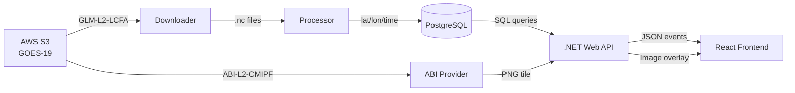

# ⚡ Lightning Tracker — BLUEOCEAN

> Sistema de detecção e rastreamento de relâmpagos em tempo real baseado em dados do satélite GOES-19 (GLM).

---

## 📐 Arquitetura Geral

```
┌─────────────────────────────────────────────────────────────────┐
│                        LIGHTNING TRACKER                        │
├────────────┬──────────────────────┬─────────────────────────────┤
│  FRONTEND  │      BACKEND C#     │       BACKEND PYTHON        │
│  React+Vite│  .NET 8 Web API     │  Módulos de processamento   │
│  Leaflet   │  (Orquestrador)     │  e visualização             │
├────────────┼──────────────────────┼─────────────────────────────┤
│            │                     │                             │
│  Browser   │◄─── HTTP/JSON ────► │  Python subprocess          │
│  (Mapas,   │                     │  (render, tables, ABI)      │
│   Charts,  │◄─── /api/* ────────►│                             │
│   Tabelas) │                     │                             │
├────────────┴──────────────────────┴─────────────────────────────┤
│                       BANCO DE DADOS                            │
│         PostgreSQL + PostGIS  |  SQLite (fallback)              │
├─────────────────────────────────────────────────────────────────┤
│                       DADOS EXTERNOS                            │
│    AWS S3: noaa-goes19 (GLM-L2-LCFA, ABI-L2-CMIPF)             │
└─────────────────────────────────────────────────────────────────┘
```

---

## 📁 Estrutura de Diretórios

```
lightning_tracker/
├── main.py                     # Entry point do serviço Python standalone
├── requirements.txt            # Dependências Python
├── config/
│   ├── settings.yaml           # Configuração principal (AWS, plot, geo, etc.)
│   └── service_takers.csv      # Lista de tomadores de serviço (lat/lon)
├── src/                        # Módulos Python (core do sistema)
│   ├── core.py                 # Loop principal de operação
│   ├── config.py               # Schema e carregamento de settings.yaml
│   ├── downloader.py           # Download de GLM do S3
│   ├── processor.py            # Extração de pontos de arquivos NetCDF
│   ├── visualizer.py           # Renderização Matplotlib (mapas scatter/density)
│   ├── web_render.py           # Renderização headless para web (PNG/MP4)
│   ├── web_tables.py           # Geração de tabelas de frequência
│   ├── web_auto_select.py      # Seleção automática de tomador ativo
│   ├── web_background.py       # Bridge para background IR via web
│   ├── background.py           # Provider ABI IR (download + reprojeção)
│   ├── db.py                   # Conexão e operações PostgreSQL (pg8000)
│   ├── db_sqlite.py            # Operações SQLite (fallback)
│   ├── data_store.py           # Abstração de acesso a dados (PG/S3)
│   ├── fetch_tracker.py        # Rastreamento incremental de downloads
│   ├── cleanup.py              # Limpeza de arquivos .nc expirados
│   ├── archiver.py             # Arquivamento de screenshots/tabelas
│   ├── geo.py                  # Cálculos geográficos (haversine, bbox)
│   ├── mpl_setup.py            # Configuração de backend Matplotlib
│   ├── notifier.py             # Sistema de beep para alertas locais
│   ├── service_takers.py       # Loader de tomadores de serviço
│   ├── timeutils.py            # Utilitários de data/hora
│   └── ui.py                   # UI helpers para modo standalone
├── scripts/                    # Scripts operacionais
│   ├── sync_recent_glm_to_postgres.py   # ⭐ Sync contínuo GLM→PG (usado pelo backend)
│   ├── backfill_glm_to_postgres.py      # Backfill histórico de arquivos .nc
│   ├── create_service_takers_db.py      # Cria SQLite de tomadores a partir do CSV
│   ├── web_abi_tile.py                  # Gera tile ABI IR via stdout (usado pelo backend)
│   ├── ingest_nc_to_db.py              # Ingestão unitária .nc → PostgreSQL
│   ├── ingest_nc_to_sqlite.py          # Ingestão unitária .nc → SQLite
│   └── validate_production.py          # Testes de validação de produção
├── webapp/
│   ├── frontend/               # React + Vite + Leaflet (ver README_FRONTEND.md)
│   └── backend/                # .NET 8 Web API (ver README_BACKEND.md)
├── data/                       # Dados brutos e processados (gitignore)
│   ├── raw/glm_20s_goes/       # Arquivos .nc baixados do S3
│   └── raw/abi_ir/             # Cache de imagens ABI IR
└── output/                     # Saídas geradas
    ├── screenshots/            # Capturas arquivadas
    └── tables/                 # CSVs de tabelas geradas
```

---

## 🔄 Fluxo Principal de Dados



### Ciclo de Sync (a cada 5 min):
1. **GlmSyncHostedService** (C#) invoca `sync_recent_glm_to_postgres.py`
2. Script Python baixa últimos N minutos de GLM do S3
3. Extrai flashes/events dos NetCDF via `processor.extract_points_from_lcfa()`
4. Insere em `raw_files` + `lightning_events` no PostgreSQL
5. Purga blobs antigos além da janela de retenção

### Ciclo de Alertas (Sentinela Nowcast Engine - a cada 2 min):
1. **LightningAlertWorker** (C#) invoca o motor de Nowcast Python (`src.nowcast.engine`).
2. **Clustering (DBSCAN)**: Isola células convectivas usando densidade de flashes (EPS=20km, MinSamples=5).
3. **Rastreamento (Hungarian Algorithm)**: Associa células entre quadros usando matriz de custo multi-fator (distância + área + intensidade).
4. **Impacto & ETA**: Calcula tempo de chegada estimado para cada tomador. Se uma tempestade está próxima (<100km) mas sem trajetória definida, o sistema utiliza um **fallback de proximidade** com estimativa baseada na célula mais próxima.
5. **Human-in-the-Loop**:
    - Alertas Red/Yellow/Observing entram na **Fila de Validação**.
    - Meteorologistas podem ajustar a **Duração** e inserir o **ETA Manual** antes de aprovar.
6. **Auto-Approve**: Alertas de alta confiança (>80%) com *Lightning Jump* detectado são enviados automaticamente via WhatsApp.
7. **Monitoramento Ativo**: 
    - **Atualizações Automáticas**: O sistema envia um novo relatório a cada **30 minutos** informando a contagem de raios nos anéis de 30/50/100/200km e o horário da próxima atualização.
    - Operadores podem alterar níveis ou encerrar alertas em tempo real.
8. **Controle de Visualização**: O mapa possui um toggle para habilitar/desabilitar a visualização das projeções e polígonos de Nowcast para manter a interface performática.

---

## ⚙️ Variáveis de Ambiente

| Variável | Obrigatória | Descrição |
|---|---|---|
| `LIGHTNING_TRACKER_PG_DSN` | Sim (produção) | DSN PostgreSQL (`host=... port=... dbname=... user=... password=...`) |
| `LIGHTNING_TRACKER_PYTHON_CMD` | Não | Comando Python (default: `python`) |
| `LIGHTNING_TRACKER_SYNC_ENABLED` | Não | Habilita sync automático (default: `true`) |
| `LIGHTNING_TRACKER_SYNC_INTERVAL_SECONDS` | Não | Intervalo de sync (default: `300`) |
| `LIGHTNING_TRACKER_SYNC_LOOKBACK_MINUTES` | Não | Janela de lookback (default: `5`) |
| `LIGHTNING_TRACKER_SYNC_RETENTION_HOURS` | Não | Retenção de blobs (default: `3`) |
| `MPLBACKEND` | Não | Backend Matplotlib (default: `Agg` para server) |

---

## 🚀 Como Executar

### Pré-requisitos
- Python 3.11+
- .NET 8 SDK
- Node.js 18+
- PostgreSQL 15+ com PostGIS

### 1. Backend Python (dependências)
```bash
pip install -r requirements.txt
```

### 2. Banco de Dados
```bash
# Criar schema PostgreSQL
psql -f webapp/backend/db/init_schema_postgres.sql

# Criar SQLite de tomadores
python scripts/create_service_takers_db.py
```

### 3. Backend C#
```bash
cd webapp/backend
dotnet run
# Escuta em http://127.0.0.1:5080
```

### 4. Frontend
```bash
cd webapp/frontend
npm install
npm run dev
# Escuta em http://localhost:5173, proxy /api → :5080
```

---

## 📊 Modos de Visualização

| Mode | Descrição | Dados |
|------|-----------|-------|
| 1 | Flashes (scatter) | `kind='flash'` |
| 2 | Flashes (densidade) | `kind='flash'` + heatmap |
| 3 | Events (scatter) | `kind='event'` |
| 4 | Events (densidade) | `kind='event'` + heatmap |

---

## 🔑 Conceitos-Chave

- **Tomador de Serviço**: Ponto geográfico monitorado (plataforma do cliente). ID=0 = "América do Sul" (visão continental)
- **GLM-L2-LCFA**: Produto Lightning Cluster-Filter Algorithm do GOES-19
- **ABI-L2-CMIPF**: Imagem infravermelha (CH13) do GOES-19 para overlay de nuvens
- **Radii**: Anéis concêntricos de 30/50/100/200 km ao redor do tomador
- **BRT (UTC-3)**: Todas as interfaces usam horário de Brasília

---

## 📝 Notas Técnicas

1. **Caminhos Non-ASCII no Windows**: `netCDF4` falha com caminhos absolutos não-ASCII. O código usa caminhos relativos ASCII como workaround.
2. **Matplotlib Agg**: Backend headless obrigatório em server. Controlado via `src/mpl_setup.py`.
3. **DSN dual-format**: Suporta tanto `host=... port=...` (libpq) quanto `postgresql://...` (URI).
4. **Haversine duplicado**: A fórmula aparece em 3 locais (Python, C#, JavaScript) — todos consistentes com R=6371km.